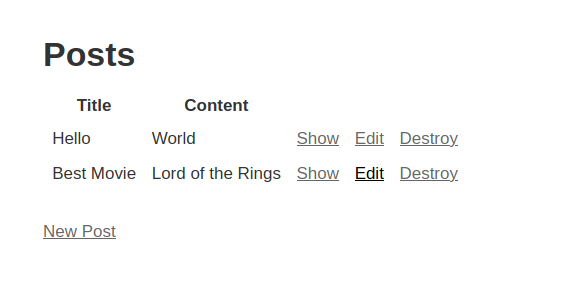

# Docker Rails

> The purpose of this very simple web-app is to apply some of the knowledge I learned from [Docker for Rails Developers](https://pragprog.com/book/ridocker/docker-for-rails-developers) book _by Rob Isenberg_.

I used _PostgreSQL_ to keep a table of _posts_.  
I used _Redis_ to keep a simple counter of _welcome_ page views.

## Requirements

For sure you need to have [Docker](https://docker.io) and [Docker Compose](https://docs.docker.com/compose/install/) installed.

## Usage

Use the following command to run the app on [localhost:3000](localhost:3000)

```sh
docker-compose up -d
```

On [localhost:3000/welcome](localhost:3000/welcome) you should get  


On [localhost:3000/posts](localhost:3000/posts) you should get  


Stop the app using `docker-compose down`!

## Diagram


You can find out more at <https://docs.docker.com/compose/rails>.
